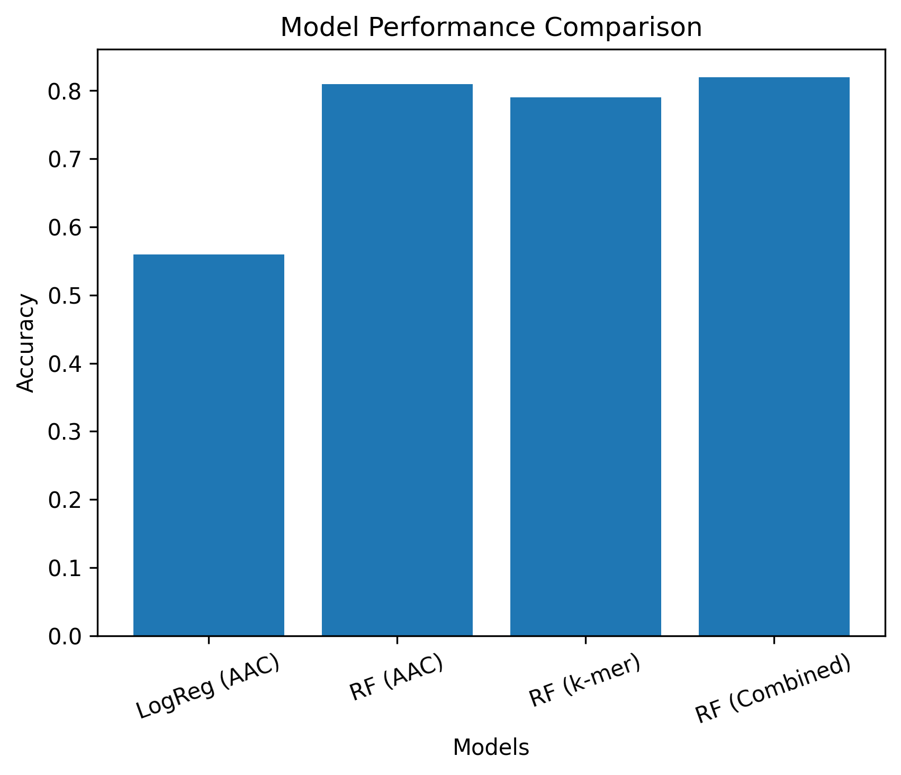
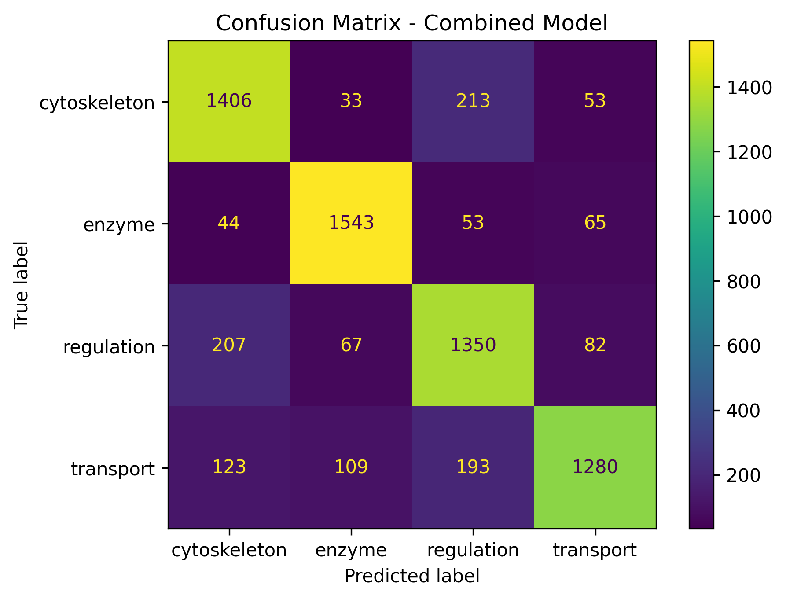
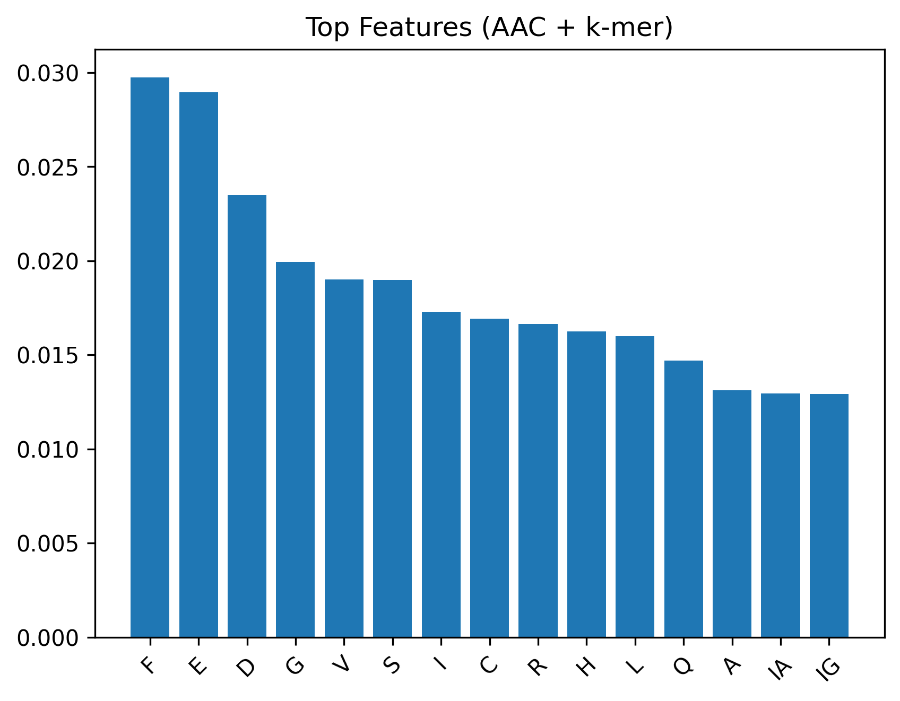
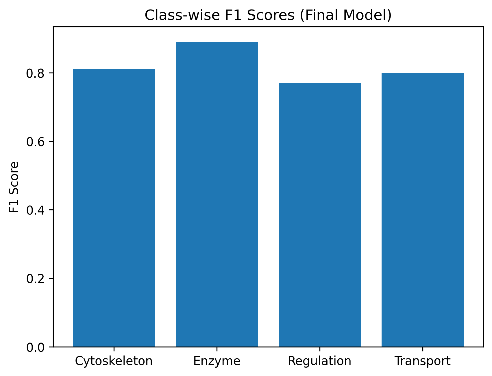

#  Protein Function Prediction using Machine Learning

##  Overview

This project builds a machine learning pipeline to **predict protein function directly from amino acid sequences**.
Proteins are classified into four functional categories:
* Cytoskeleton
* Enzyme
* Regulation
* Transport
  
The project explores how different sequence representations impact model performance, combining **bioinformatics feature engineering** with **machine learning**.

##  Problem Statement
Experimental annotation of protein function is:
* Time-consuming
* Expensive
* Not scalable
This project demonstrates a **computational approach** to predict protein function efficiently using sequence data.

##  Approach
###  1. Data Preparation
* Combined multiple protein datasets
* Assigned functional labels
* Handled class imbalance using **random undersampling**

###  2. Feature Engineering
####  Amino Acid Composition (AAC)
* Converts sequence → frequency of 20 amino acids
* Captures **global composition**
####  k-mer Features (k = 2)
* Extracted top 100 dipeptides
* Captures **local sequence patterns**
#### Combined Features
* Integrated AAC + k-mer
* Captures both **global + local information**

### 3. Model Development
* Logistic Regression (baseline)
* Random Forest (primary model)
  
### 🔹 4. Evaluation Strategy
* Stratified Train-Test Split (80/20)
* Metrics:
  * Accuracy
  * Precision
  * Recall
  * F1-score
* Confusion matrix analysis

##  Results

| Model               | Features        | Accuracy |
| ------------------- | --------------- | -------- |
| Logistic Regression | AAC             | 56%      |
| Random Forest       | AAC             | 81%      |
| Random Forest       | k-mer           | 79%      |
| **Random Forest**   | **AAC + k-mer** | **82%**  |


##  Visual Results

###  Model Performance Comparison



###  Confusion Matrix (Final Model)



###  Feature Importance (AAC + k-mer)



### Class-wise Performance



## Key Insights
* Random Forest significantly outperforms linear models
* AAC provides strong baseline performance
* k-mer features capture important sequence motifs
* Combining features improves overall accuracy and stability
* Regulatory proteins are harder to classify due to functional diversity

##  Biological Interpretation
* Charged amino acids (E, D) contribute to functional prediction
* Hydrophobic residues (F, I) are important in structure and transport
* k-mers reveal biologically meaningful sequence patterns

##  Tech Stack
* Python
* Pandas, NumPy
* Scikit-learn
* Matplotlib, Seaborn
* Google Colab

## How to Run
1. Open the notebook in Google Colab
2. Mount Google Drive
3. Place dataset files in:

```text
/content/drive/MyDrive/Colab Notebooks/
```
4. Run all cells sequentially

## Limitations
* AAC ignores sequence order
* k-mer increases feature dimensionality
* No structural (3D) protein data used

## Future Work
* Use protein embeddings (ProtBERT, ESM)
* Incorporate structural features
* Apply deep learning models
* Deploy as a web-based prediction tool

## Project Highlights
 End-to-end ML pipeline
 Bioinformatics + Machine Learning integration
 Feature engineering on biological sequences
 Model comparison and optimization
 Interpretability using feature importance

